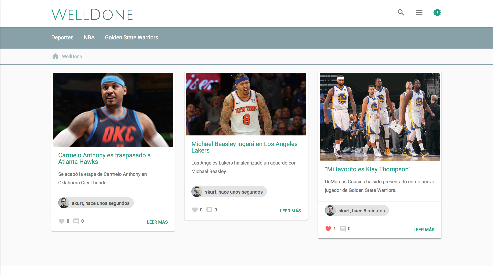

#Welldone

Welldone is a Medium clone

## 1. Install:
Fist, you must clone this repo to your local:

    > git clone https://github.com/skurt23/Welldone.git

Create your virtual environment and, after that, install our dependencies:

    > pip install -r  requirements.txt
    
Make migrations
    
    > python manage.py makemigrations
    > python manage.py migrate
    
Install our web dependencies
	
	> npm install
	
If you want to install the admin panel, you must move to welldone.admin folder

    > cd welldone-admin
    
Now we can install our dependencies

    > npm install
    > npm run start
	
Now, you can run Welldone!

    > python manage.py runserver

